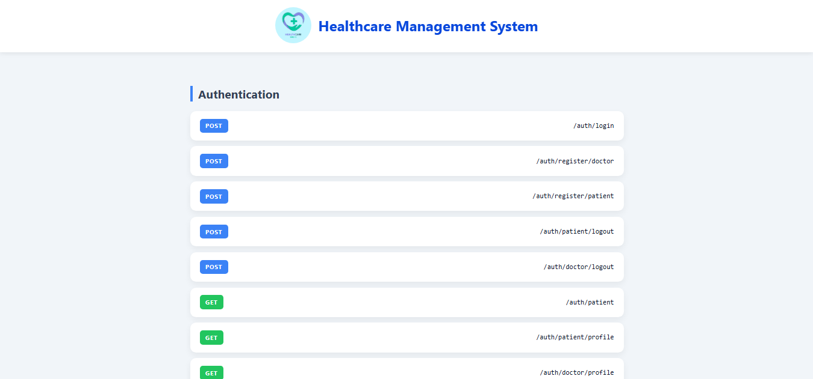

<p align="center">
  
</p>

# 🏥 Healthcare Management System – Backend

A robust backend for managing healthcare appointments with secure authentication, doctor–patient workflows, slot scheduling, and automated notifications.  
All RESTful API endpoints are **implemented, tested, and verified** ensuring stability, scalability, and seamless integration.

<p align="center">
🔗 Local API Dashboard: <a href="http://localhost:5000/">http://localhost:5000/</a>
</p>

---

## 📸 API Dashboard Preview

<p align="center">
  
</p>
----

## ✨ Key Highlights
- 🔐 JWT Authentication & Role-Based Access Control (RBAC)
- 🧑‍⚕️ Doctor & Patient registration workflows
- ⏳ Smart slot scheduling system
- 📅 Appointment booking / rescheduling / cancellation
- 📧 Automated email notifications
- 🌐 Built-in API documentation dashboard (custom HTML UI) 

---

## 🧠 Architecture


---
## ⚙️ Tech Stack
Built with **NestJS**, **PostgreSQL**, and **TypeORM** ensuring modularity, high performance, and maintainability — suitable for clinics, hospitals, and telemedicine platforms.


---

# 📌 API Endpoints

## 🔐 AuthController (`/api/auth`)
| Method   | Endpoint              | Description                  |
|----------|-----------------------|------------------------------|
| 📥 POST  | `/login`              | User login (JWT issued)      |
| 🩺 POST  | `/register/doctor`    | Register new doctor account  |
| 🧑‍⚕️ POST | `/register/patient`   | Register new patient account |
| 🚪 POST  | `/patient/logout`     | Logout patient               |
| 🚪 POST  | `/doctor/logout`      | Logout doctor                |
| 📋 GET   | `/patient`            | Get all patients (auth req.) |
| 🆔 GET   | `/patient/profile`    | Get logged-in patient profile|
| 🆔 GET   | `/doctor/profile`     | Get logged-in doctor profile |

---

## 👨‍⚕️ Patients (`/api/patients`)
| Method   | Endpoint            | Description            |
|----------|---------------------|------------------------|
| ✏️ PATCH | `/api/patients/:id` | Update patient details |
| 📋 GET   | `/api/patients`     | Get all patients       |

---

## ⏳ Slots (`/api/slots`)
| Method   | Endpoint                  | Description                  |
|----------|---------------------------|------------------------------|
| ➕ POST  | `/api/slots`              | Create a slot                |
| 📋 GET   | `/api/slots`              | Get all slots                |
| 📋 GET   | `/api/slots/doctor/:id`   | Get slots for a doctor       |
| 🚫 PATCH | `/api/slots/:id/unavailable` | Mark a slot unavailable   |

---

## 📅 Appointments (`/api/appointments`)
| Method   | Endpoint                        | Description                 |
|----------|---------------------------------|-----------------------------|
| 📅 POST  | `/api/appointments/book`        | Book an appointment        |
| 📋 GET   | `/api/appointments/patient/:id` | Get patient appointments   |
| 📋 GET   | `/api/appointments`             | Get all appointments       |
| ❌ PATCH | `/api/appointments/cancel/:id`  | Cancel an appointment      |
| 🔄 PATCH | `/api/appointments/reschedule/:id` | Reschedule appointment |

---

## 🛠 Development Tools
[]()
[]()
[]()

| Tool             | Purpose                                    |
|------------------|--------------------------------------------|
| ⚙️ TypeORM CLI    | Database migrations, schema sync, seeding |
| 📬 Postman       | API testing & documentation               |
| 🗄️ pgAdmin       | PostgreSQL DB management & queries        |

---

## 🚀 Running the App

```bash
# Install dependencies
npm install

# Start PostgreSQL (ensure it's running or via pgAdmin)

# Run the app in development mode
npm run start:dev
```
----
📁 Project Highlights

- Clean NestJS architecture
- Validation Pipes
- Guards & Custom Decorators
- Error Handling
- Slot conflict prevention
- Custom API documentation dashboard

---

🚀 Future Improvements

- Video consultation (WebRTC)
- Online payments
- Admin analytics dashboard
- SMS reminders
- Mobile app integration

---
####👨‍💻 Author
##Ravi Shankar Singh
Backend Developer (Node.js | NestJS | PostgreSQL)
